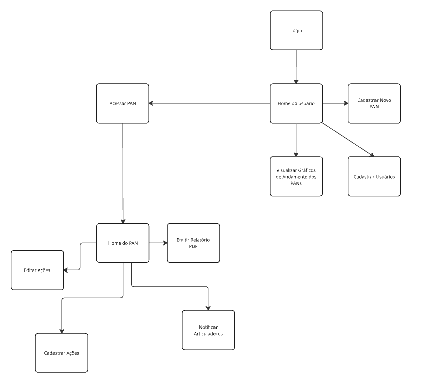
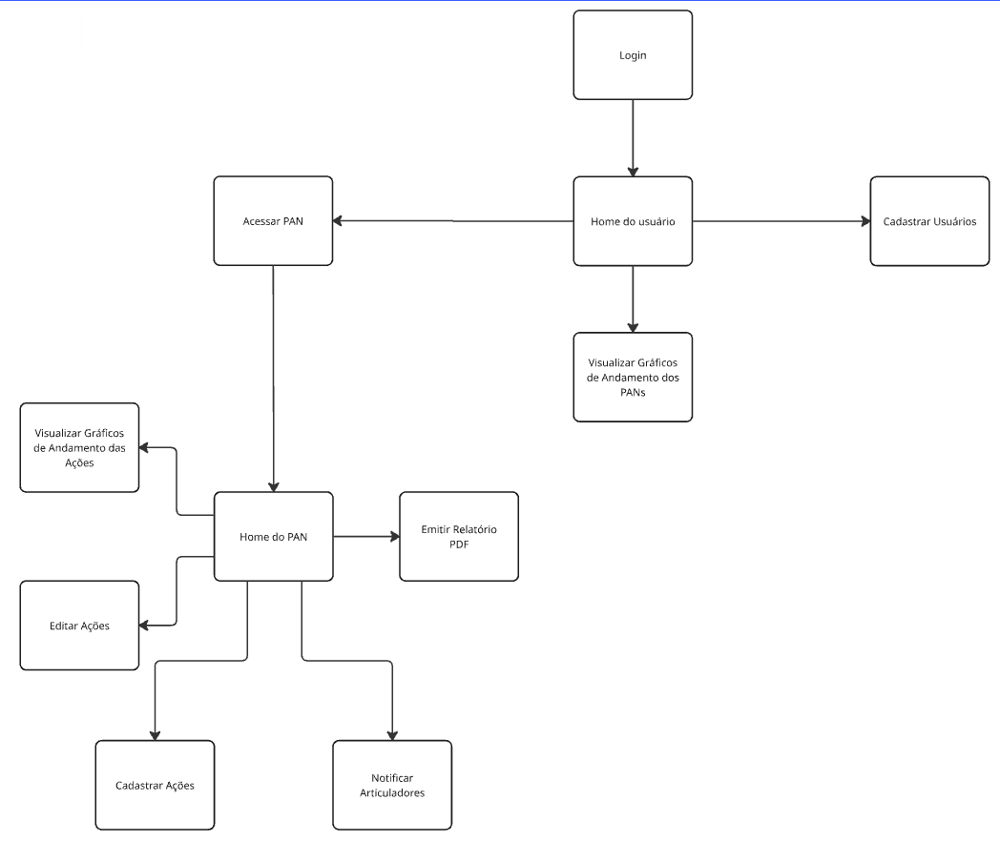
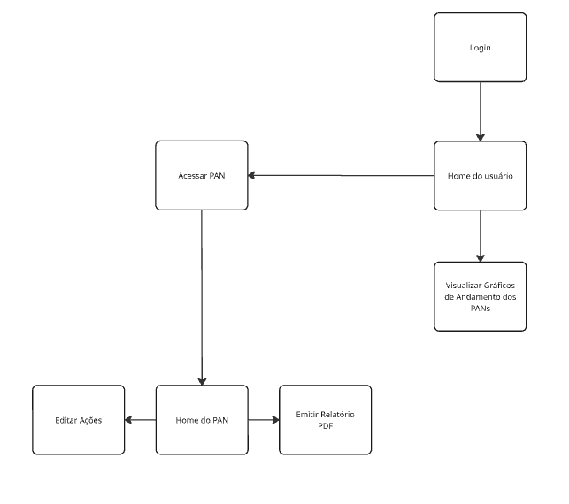
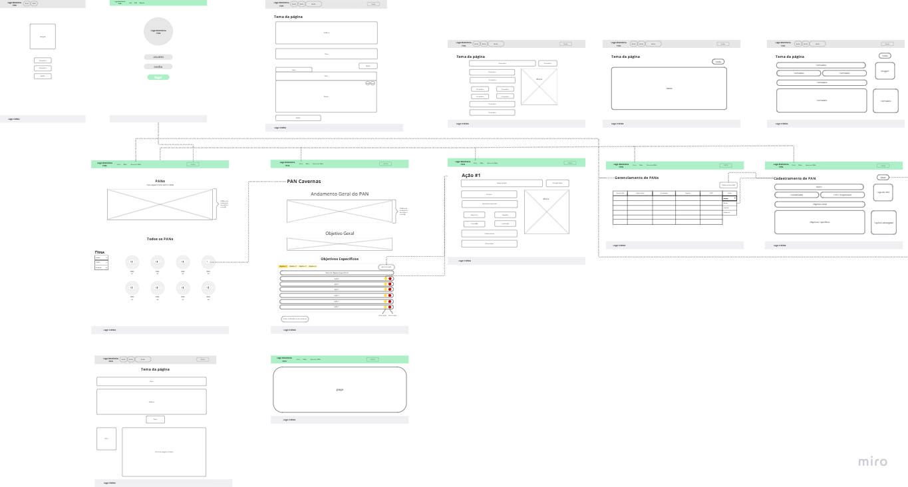

# Projeto de Interface

O *user flow* e o *wireframe* da aplicação foram construídos colaborativamente na plataforma Miro e podem ser visualizados clicando [aqui](https://miro.com/welcomeonboard/VVo2TkJaaHIzVmh3c1M1THZZS3ltdDNwbE0xZFJHNEQwQWlYd1A4dUh6L1dpK1hXZTRyOG55ck1FMWhjTjBxVzdLN0ZCNFNWTmNEY2NGWHl5djRUeWxqd1ZON2U3TnVOWE12QXVnRTU2aytXTlV5NElwY3FtYXZpdFZRN25pMURhWWluRVAxeXRuUUgwWDl3Mk1qRGVRPT0hdjE=?share_link_id=852268613612).

Dentro do sistema, teremos fluxos diferentes de acordo com o nível de permissão que o usuário tem. Para saber mais sobre as [personas](especification.md#personas) e sobre as [histórias de usuário](especification.md#histórias-de-usuários), consulte a documentação específica.

### User Flow
Fluxo de usuário (User Flow) é uma técnica que permite ao desenvolvedor mapear todo o fluxo de telas do site ou app. Essa técnica funciona para alinhar os caminhos e as possíveis ações que o usuário pode fazer junto com os membros de sua equipe.

O fluxo de usuário na aplicação dependerá do perfil de acesso atribuído a ele. Nesta aplicação, haverá os seguintes perfis: Administrador, Coordenador, Articulador e Usuário Comum. As funcionalidades da aplicação estarão disponíveis de forma aninhada, dando ao Administrador acesso total às funcionalidades, que decrescerão em número no seguinte sentido: Coordenador, Articulador e Usuário Comum, que será o perfil com a menor quantidade de funcionalidades.

##### Fluxo do Administrador

O Administrador acessará a página inicial (*landing page*), na qual terá a visualização de gráficos sobre o andamento dos PANs, um painel com todos os PANs cadastrados e um menu de filtro para exibição dos PANs no painel. No cabeçalho da página, haverá um menu com os seguintes botões: 

* Início: leva o usuário à página inicial.
* Gerenciar PANs: leva à página de gerenciamento dos PANs.
* Cadastrar usuário: leva à página de cadastramento de usuários.
* Login: leva à página de login.

Após efetuar o login, ao clicar em 'Gerenciar PANs', o Administrador irá cadastrar o primeiro PAN no sistema por meio das páginas 'Gerenciamento de PANs' e 'Cadastramento de PANs'. Em seguida, será cadastrado o Coordenador do PAN. Ao salvar, o Administrador é redirecionado à página de Gerenciamento de PANs, onde poderá cadastrar outros PANs ou editar suas informações.

##### Fluxo do Coordenador

Uma vez tendo um PAN cadastrado, o Coordenador, após efetuar login no sistema, na página inicial, poderá acessar a página do seu PAN, filtrando o painel de PANs e clicando sobre o logo do PAN. Na página do PAN, poderá adicionar as Ações de cada objetivo específico ao clicar no botão 'Adicionar Ação' e será redirecionado para a página de cadastramento de Ação, onde preencherá o formulário com os dados da Ação, incluindo o cadastro do Articulador. Após cadastrar as Ações, de volta à página do PAN, pelo painel das ações, o Coordenador poderá excluir uma ação, editá-la (sendo redirecionado novamente à página da Ação) e enviar notificação aos Articuladores.

##### Fluxo do Articulador

Após as ações terem sido cadastradas, o Articulador, ao efetuar o login no sistema, acessará o PAN por meio do filtro de PANs e poderá editar as Ações que estão sob sua responsabilidade para atualizar os andamentos.

##### Fluxo do Usuário Comum

O usuário comum acessará o sistema sem necessidade de realizar login. Ele não terá permissão de edição, apenas visualização dos dados. Ele poderá navegar pelas páginas Inicial, PAN e Ação, e poderá emitir relatório em PDF de cada PAN.

### Wireframes

O layout da aplicação terá um cabeçalho com um menu contendo links para as principais páginas e um rodapé com a logo e marca institucional. O conteúdo principal das páginas será variado de acordo com as funcionalidades a serem disponibilizadas. Como exemplo de elementos das páginas, haverá botões, tabelas, listas, imagens e formulários. A disposição destes elementos em cada página pode ser visualizada em detalhes no [Miro](https://miro.com/welcomeonboard/VVo2TkJaaHIzVmh3c1M1THZZS3ltdDNwbE0xZFJHNEQwQWlYd1A4dUh6L1dpK1hXZTRyOG55ck1FMWhjTjBxVzdLN0ZCNFNWTmNEY2NGWHl5djRUeWxqd1ZON2U3TnVOWE12QXVnRTU2aytXTlV5NElwY3FtYXZpdFZRN25pMURhWWluRVAxeXRuUUgwWDl3Mk1qRGVRPT0hdjE=?share_link_id=852268613612).

