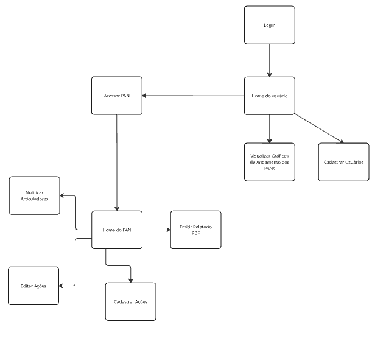
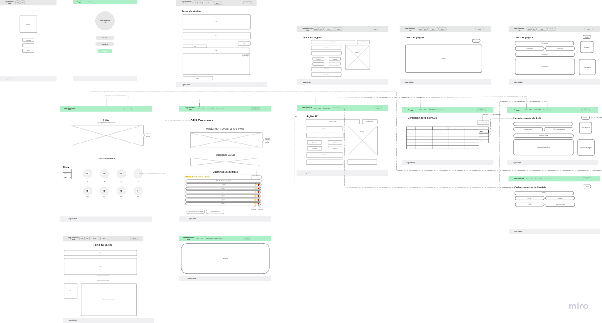

# Projeto de Interface

*Visão geral da interação do usuário pelas telas do sistema e protótipo interativo das telas com as funcionalidades que fazem parte do sistema (wireframes).*

 *Apresente as principais interfaces da plataforma. Discuta como ela foi elaborada de forma a atender os requisitos funcionais, não funcionais e histórias de usuário abordados nas <a href="2-Especificação do Projeto.md"> Documentação de Especificação</a>.*

 O *user flow* e o *wireframe* da aplicação foram construído colaborativamente na plataforma Miro e podem ser visualizados clicando [aqui](https://miro.com/welcomeonboard/VVo2TkJaaHIzVmh3c1M1THZZS3ltdDNwbE0xZFJHNEQwQWlYd1A4dUh6L1dpK1hXZTRyOG55ck1FMWhjTjBxVzdLN0ZCNFNWTmNEY2NGWHl5djRUeWxqd1ZON2U3TnVOWE12QXVnRTU2aytXTlV5NElwY3FtYXZpdFZRN25pMURhWWluRVAxeXRuUUgwWDl3Mk1qRGVRPT0hdjE=?share_link_id=852268613612).

## User Flow e Wireframes

### User Flow
Fluxo de usuário (User Flow) é uma técnica que permite ao desenvolvedor mapear todo fluxo de telas do site ou app. Essa técnica funciona para alinhar os caminhos e as possíveis ações que o usuário pode fazer junto com os membros de sua equipe.

O fluxo de usuário na aplicação dependerá do perfil de acesso atribuído a ele. Nesta aplicação haverá os seguintes perfis: Administrador, Coordenador, Articulador e Usuário Comum. As funcionalidades da aplicação estarão disponíveis de forma aninhada, dando ao Administrador acesso total as funcionalidades, que decresceram em número do seguinte sentido: Coordenador, Articulador e Usuário Comum, que será o perfil com a menor quantidade de funcionalidades.

##### Fluxo do Administrador (!Atualizar figura!)

O Administrador acessará a página inicial (*landing page*), na qual terá a visualização de gráficos sobre o andamento dos PANs, um painel com todos dos PANs cadastrados, e um menu de filtro para exibição dos PANs no painel. No cabeçalho da página haverá um menu com os seguintes botões: 

* Início: leva o usuário à página inicial.
* PANs: (?igual ao Início???)
* Gerenciar PANs: leva à página de gerenciamento dos PANs.
* Login: leva à página de login (?será mantida?)

Após efetuar o login, ao clicar em 'Gerenciar PANs', o Administrador irá cadastrar o primeiro PAN no sistema, por meio das páginas 'Gerenciamento de PANs' e 'Cadastramento de PANs'. Em seguida, será cadastrado o Coordenador do PAN (?página?). Ao salvar, o Administrador é redirecionado à página de Gerenciamento de PANs, onde poderá cadastrar outros PANS ou editar suas informações.

##### Fluxo do Coordenador (!Atualizar figura!)

Uma vez tendo um PAN cadastrado, o Coordenador, após efetuar login no sistema, na página inicial, poderá acessar a página do seu PAN, filtrando o painel de PANs e clicando sobre a logo do PAN. Na página do PAN, poderá adicionar as Ações de cada objetivo específico ao clicar no botão 'Adicionar Ação' e sendo redirecionado para a página de cadastramento de Ação, onde preencherá o formulário com os dados da Ação, incluindo o cadastro do Articulador. Após cadastrar as Ações, de volta à página do PAN, pelo painel das ações o Coordenador poderá excluir uma ação, editá-la (sendo redirecionado novamente à página da Ação) e enviar notificação aos Articuladores.

##### Fluxo do Articulador (!Atualizar figura!)

Após as ações terem sido cadastradas, o Articulador, ao efetuar o login no sistema, acessará o PAN por meio do filtro de PANs e poderá editar as Ações que estão sob sua responsabilidade para atualizar os andamentos.

##### Fluxo do Usuário Comum

O usuário comum acessará o sistema sem necessidade de realizar login. Ele não terá permissão de edição, apenas visualização dos dados.Ele poderá navegar pelas páginas Inicial, PAN e Ação, e poderá emitir relatório em PDF de cada PAN.

### Wireframes

O layout da aplicação terá um cabeçalho com um menu contendo links para as principais páginas e um rodapé com a logo marcar institucional. O conteúdo principal das páginas será variado de acordo com as funcionalidades a serem disponibilizadas. Como exemplo de elementos das páginas haverá botões, tabelas, listas, imagens e formulários. A disposição destes elementos em cada página pode ser visualizada em detalhes no [Miro](https://miro.com/welcomeonboard/VVo2TkJaaHIzVmh3c1M1THZZS3ltdDNwbE0xZFJHNEQwQWlYd1A4dUh6L1dpK1hXZTRyOG55ck1FMWhjTjBxVzdLN0ZCNFNWTmNEY2NGWHl5djRUeWxqd1ZON2U3TnVOWE12QXVnRTU2aytXTlV5NElwY3FtYXZpdFZRN25pMURhWWluRVAxeXRuUUgwWDl3Mk1qRGVRPT0hdjE=?share_link_id=852268613612).

São protótipos usados em design de interface para sugerir a estrutura de um site web e seu relacionamentos entre suas páginas. Um wireframe web é uma ilustração semelhante do layout de elementos fundamentais na interface e é fundamental sempre relacionar cada wireframe com o(s) requisito(s) que ele atende.

### Exemplo

> **Links Úteis**:
> - [User Flow: O Quê É e Como Fazer?](https://medium.com/7bits/fluxo-de-usu%C3%A1rio-user-flow-o-que-%C3%A9-como-fazer-79d965872534)
> - [User Flow vs Site Maps](http://designr.com.br/sitemap-e-user-flow-quais-as-diferencas-e-quando-usar-cada-um/)
> - [Top 25 User Flow Tools & Templates for Smooth](https://www.mockplus.com/blog/post/user-flow-tools)

*A tela inicial apresenta um menu lateral com as principais seções do portal, enquanto a navigation bar, ao topo, apresenta informações de envio de imagens ou navegação pela galeria de fotos. A área central apresenta a galeria de fotos na forma de uma grade. Nesta tela, são apresentados os seguintes requisitos*

 
> **Links Úteis**:
> - [Protótipos vs Wireframes](https://www.nngroup.com/videos/prototypes-vs-wireframes-ux-projects/)
> - [Ferramentas de Wireframes](https://rockcontent.com/blog/wireframes/)
> - [MarvelApp](https://marvelapp.com/developers/documentation/tutorials/)
> - [Figma](https://www.figma.com/)
> - [Adobe XD](https://www.adobe.com/br/products/xd.html#scroll)
> - [Axure](https://www.axure.com/edu) (Licença Educacional)
> - [InvisionApp](https://www.invisionapp.com/) (Licença Educacional)

## Fluxograma

Dentro do do sistema teríamos fluxos diferentes de acordo com o nível de permissão que o usuário tem, para saber mais sobre as [personas](especification.md#personas) e sobre [histórias de usuário](especification.md#histórias-de-usuários)

