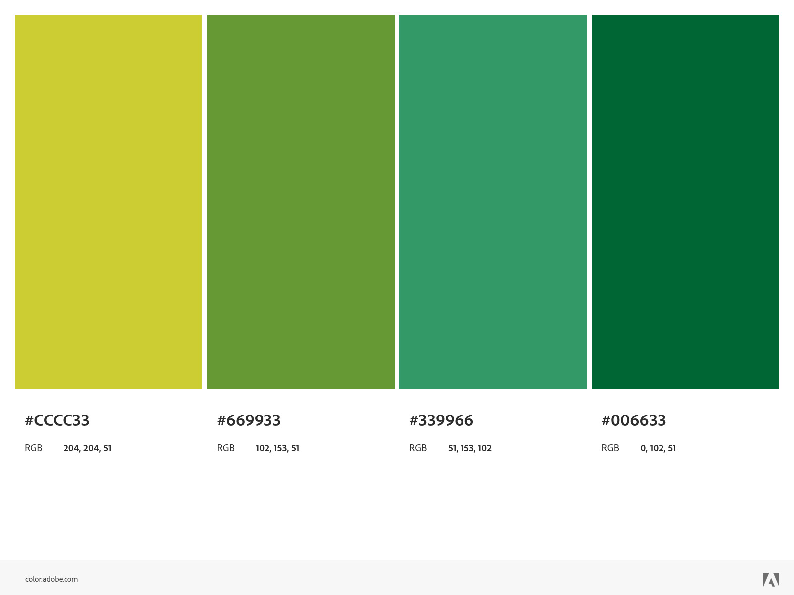
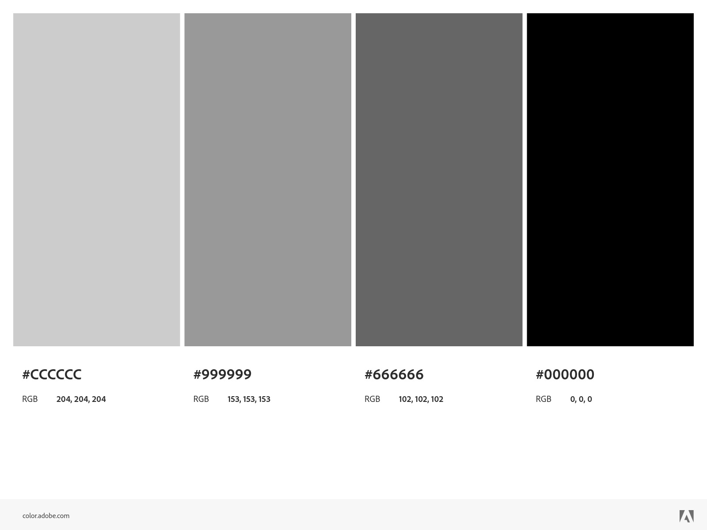

# Template padrão do site

*Layout padrão do site (HTML e CSS) que será utilizado em todas as páginas com a definição de identidade visual, aspectos de responsividade e iconografia.*

*Explique as guias de estilo utilizadas no seu projeto.*

O layout padrão da nossa aplicação foi construído a partir da linguagem de marcação HTML e da linguagem de estilos CSS. A combinação destas linguagens possibilitará a concepção de um website responsivo. Os elementos padrões das páginas serão `header` e o `footer`, conforme descrito da documentação do [interface](./interface.md) na seção *wireframe*.

## Design

*Detalhe os layouts que serão utilizados. Apresente onde será colocado o logo do sistema. Defina os menus padrões, entre outras coisas.*

Um logotipo foi criado baseando-se no manual de identidade visual do Instituto Chico Mendes de Conservação da Biodiversidade - ICMBio. Este logo tem os dizeres "MONITORIA PAN" e utiliza-se ce círculos em tons de verdes que são marca da identidade visual do ICMBio. No `footer`, utilizaremos o logotipo do ICMBio conferindo um aspecto oficial ao site.

 

## Cores
*Apresente a paleta de cores que será utilizada. Uma ferramenta interessante para a criação de palestas de cores é o Adobe Color (https://color.adobe.com/pt/create/color-wheel).*

O site seguirá a paleta de cores definidas no Manual Visual do ICMBio a fim de se manter uma continuidade da identidade visual corporativa. Assim,  ao usuário será oferecida a experiência de estar em um único ecossistema ao transicionar das demais páginas do ICMBio para o site objeto desta documentação. A paleta de cores será composta pelas seguintes cores: #CCCC33, #669933, #339966, #006633. A escala de cinza utilizada será: #000000, #666666, #999999, #CCCCCC.

## Tipografia

*Apresente as fontes que serão utilizadas e sua função no site. As principais funções são: Título de página, Título de Seção, Rótulos de componentes e Corpo de Texto.*

A fonte padrão que consta no Manual Visual do ICMBio não foi encontrada para uso livre nos principais repositórios de fontes. Por isso, foram escolhidas as fonte Roboto, que está presente em alguns sites do ICMBio, como por exemplo: [SALVE](https://salve.icmbio.gov.br/#/) e Noto Sans. Ambas são fontes livres para uso sob a licença  SIL Open Font License-Version 1.1. Não são serifadas, têm agradável legibilidade e leiturabilidade em telas, possuem todos os glifos necessários para o português, além de várias possibilidade e gradações de estilos(negrito, itálico, etc.). Quanto ao aspecto semântico, estas fontes passam ao usuário uma sensação de seriedade, técnica e científica, que está intimamente ligado ao tema do site em questão. As fontes serão importadas do Google Fonts diretamente nas folhas de estilo CSS. Alternativamente, na indisponibilidade desta fonte, na folha de estilo CSS, serão estabelecidas fontes não serifadas sugeridas pela W3C (CSS Web Safe Fonts).

## Iconografia

Defina os ícones que serão utilizados e suas respectivas funções.

Apresente os estilos CSS criados para cada um dos elementos apresentados.
Outras seções podem ser adicionadas neste documento para apresentar padrões de componentes, de menus, etc.

> **Links Úteis**:
>
> -  [Como criar um guia de estilo de design da Web](https://edrodrigues.com.br/blog/como-criar-um-guia-de-estilo-de-design-da-web/#)
> - [CSS Website Layout (W3Schools)](https://www.w3schools.com/css/css_website_layout.asp)
> - [Website Page Layouts](http://www.cellbiol.com/bioinformatics_web_development/chapter-3-your-first-web-page-learning-html-and-css/website-page-layouts/)
> - [Perfect Liquid Layout](https://matthewjamestaylor.com/perfect-liquid-layouts)
> - [How and Why Icons Improve Your Web Design](https://usabilla.com/blog/how-and-why-icons-improve-you-web-design/)