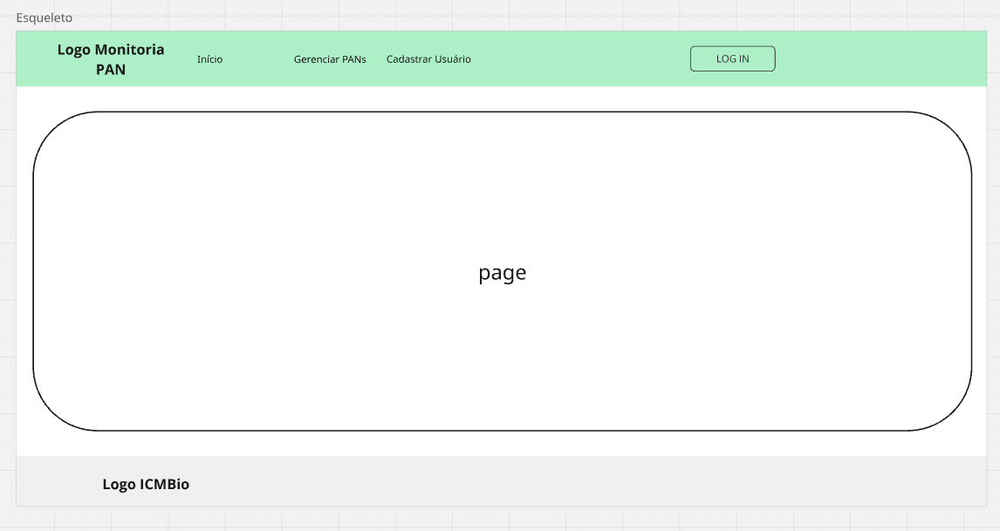

# Template padrão do site

O layout padrão da nossa aplicação foi construído a partir da linguagem de marcação HTML e da linguagem de estilos CSS. A combinação destas linguagens possibilitará a concepção de um website responsivo. Os elementos padrões das páginas serão o `header` e o `footer`, conforme descrito na documentação da [interface](./interface.md#wireframes) na seção *wireframe*.

## Design

Um logotipo foi criado baseando-se no manual de identidade visual do Instituto Chico Mendes de Conservação da Biodiversidade - ICMBio. Este logo tem os dizeres "MONITORIA PAN" e utiliza círculos em tons de verde que são marca da identidade visual do ICMBio. No `footer`, utilizaremos o logotipo do ICMBio, conferindo um aspecto oficial ao site.

 

## Cores

O site seguirá a paleta de cores definida no Manual Visual do ICMBio a fim de manter uma continuidade da identidade visual corporativa. Assim, ao usuário será oferecida a experiência de estar em um único ecossistema ao transicionar das demais páginas do ICMBio para o site objeto desta documentação. A paleta de cores será composta pelas seguintes cores: #CCCC33, #669933, #339966, #006633. A escala de cinza utilizada será: #000000, #666666, #999999, #CCCCCC.

## Tipografia

A fonte padrão que consta no Manual Visual do ICMBio não foi encontrada para uso livre nos principais repositórios de fontes. Por isso, foram escolhidas as fontes Roboto, que está presente em alguns sites do ICMBio, como por exemplo: [SALVE](https://salve.icmbio.gov.br/#/), e Noto Sans. Ambas são fontes livres para uso sob a licença SIL Open Font License-Version 1.1. Não são serifadas, têm agradável legibilidade e leiturabilidade em telas, possuem todos os glifos necessários para o português, além de várias possibilidades e gradações de estilos (negrito, itálico, etc.). Quanto ao aspecto semântico, estas fontes transmitem ao usuário uma sensação de seriedade, técnica e cientificidade, que está intimamente ligada ao tema do site em questão. As fontes serão importadas do Google Fonts diretamente nas folhas de estilo CSS. Alternativamente, na indisponibilidade destas fontes, na folha de estilo CSS, serão estabelecidas fontes não serifadas sugeridas pela W3C (CSS Web Safe Fonts).

## Iconografia

Serão usados os ícones de livre uso disponibilizados pelo Google. Eles serão importados do [Google Fonts](https://fonts.google.com/icons) diretamente nas folhas de estilo CSS.